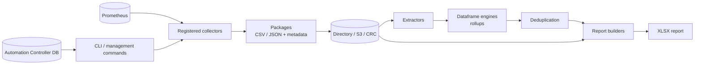
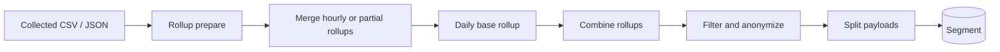
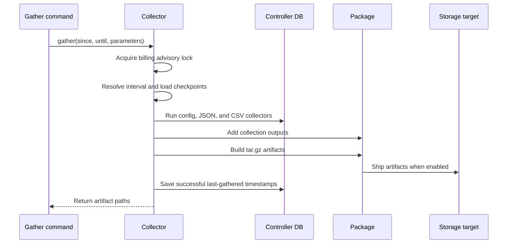
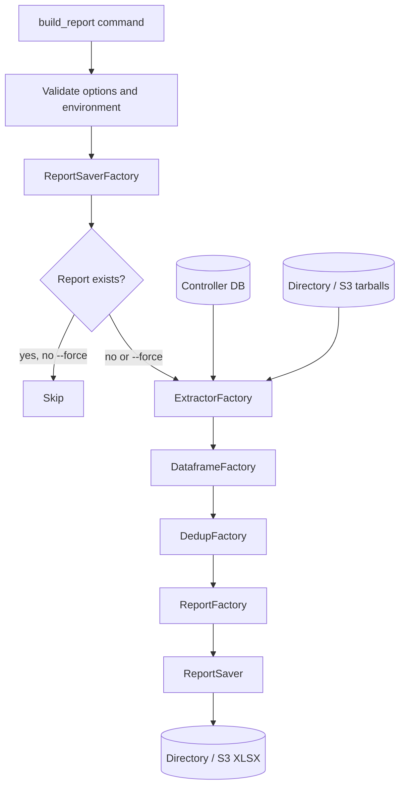

# Metrics Utility Architecture

This document describes the current architecture of `metrics-utility` for maintainers and contributors. It focuses on the data paths, boundaries, extension points, and operational contracts that are easy to miss when reading one module in isolation.

## System overview

`metrics-utility` has two related interfaces:

- The management commands provide the end-to-end gather and report workflows.
- The `metrics_utility.library` package exposes reusable collectors, storage, dataframe, rollup, and report primitives.

The main data path is:

The anonymized-data path is related but has a different output contract:

## Entry points and workflows

### Gathering Controller data

`gather_automation_controller_billing_data` validates command options and environment variables, creates `automation_controller_billing.collector.Collector`, and selects a shipping target: `directory`, `s3`, or `crc`.

The billing collector extends `base.Collector` and performs the following sequence:

The base collector discovers functions in the configured collector module by looking for metadata attached by `@register`. Each function becomes a `CollectionJSON` or `CollectionCSV` object. CSV collections may be sliced into multiple sub-collections so large or partition-aware queries can be processed and shipped incrementally.

Collection intervals use an inclusive `since` boundary and an exclusive `until` boundary. When no explicit start is supplied, persisted last-gathered values determine the incremental range. The maximum interval is controlled by `METRICS_UTILITY_MAX_GATHER_PERIOD_DAYS` and defaults to 28 days.

Successful scheduled or manual collection updates the Controller setting used by the upstream analytics collector. Failed collection keys prevent their checkpoint from advancing. Dry runs gather into temporary files but do not ship artifacts or persist checkpoints.

### Building reports

`build_report` selects the input and output implementations from `METRICS_UTILITY_SHIP_TARGET`, then runs the reporting pipeline:

CCSP and CCSPv2 reports read collected tarballs. Renewal guidance reads directly from the Controller database. Extractors load raw data into named dataframe engines; those engines combine and aggregate data before the selected deduplicator and report builder run.

## Collection and artifact model

### Collectors

Collectors should be small, parameter-driven functions. They should not read environment variables or depend on hidden global state. Time-series collectors accept timezone-aware `since` and `until` values; snapshot collectors return the current state without a time range.

The primary collector groups are:

- Controller collectors in `metrics_utility/library/collectors/controller/`
- Dashboard collectors in `metrics_utility/library/collectors/dashboard/`
- Service collectors in `metrics_utility/library/collectors/service/`
- Other external-input collectors in `metrics_utility/library/collectors/others/`

The billing workflow uses the collector module in `metrics_utility/automation_controller_billing/collectors.py`. The database tables and partition behavior of the Controller collectors are documented in [collectors-and-partitions.md](collectors-and-partitions.md).

### Packages

The base `Package` groups collection outputs into `.tar.gz` artifacts. A package contains:

- `config.json`, including collection and billing-provider context safe to persist
- `manifest.json`, recording collector names and versions
- `data_collection_status.csv`, recording start, finish, and success status
- One or more collector-produced `.csv` or `.json` files

Large collections can be divided across packages. A collection that produces sub-collections is shipped immediately so temporary files can be released and duplicate filenames remain isolated.

### Storage

Storage adapters provide a common `put`, `get`, `exists`, `remove`, and `glob` interface where the backend supports the operation. Current implementations are:

- `StorageDirectory` for local files
- `StorageS3` for S3-compatible object storage
- `StorageCRC` and `StorageCRCMutual` for console.redhat.com ingress
- `StorageSegment` for put-only analytics events

The billing package classes select the appropriate adapter and are responsible for shipping collection artifacts. Report saver classes perform the analogous operation for generated XLSX files. See [the library guide](../metrics_utility/library/README.md) for callable-level examples.

## Dataframes, rollups, and reports

The reporting implementation separates data loading from aggregation and presentation:

1. An extractor obtains tarball contents or queries the Controller database.
2. A dataframe factory creates the dataframe engines needed by the selected report.
3. Dataframe engines accept raw CSV or JSON data and produce grouped or rollup data.
4. A deduplicator removes or reconciles duplicate usage according to the report type.
5. A report builder converts the resulting dataframes into the requested XLSX format.
6. A report saver writes the XLSX to a directory or S3-compatible target.

The factory modules under `metrics_utility/automation_controller_billing/` are the selection boundaries. New implementations should normally be added behind the relevant factory rather than branching through the management command.

## Anonymized rollups

Anonymized rollups are implemented in `metrics_utility/anonymized_rollups/`. Each rollup corresponds to a collector or data category and typically exposes `prepare`, `merge`, and `base` stages.

The intended processing model is hierarchical: raw hourly data is reduced to a small serializable partial rollup, partial rollups are merged through the day, and the completed daily rollup is combined with the other categories. The final structure is flattened, sanitized, and anonymized before it is split into Segment-compatible messages.

Sensitive values such as customer-specific names and identifiers must not cross the anonymization boundary. Public collection metadata is allow-listed through `collections.json`; values outside the permitted set are filtered or replaced according to the rollup implementation. See [anonymized rollups](../metrics_utility/anonymized_rollups/anonymized_rollups.md) for the collector-to-rollup mapping and detailed processing notes.

## Concurrency, checkpoints, and failure behavior

- Gathering uses PostgreSQL advisory locks to prevent concurrent collection runs. The billing collector uses its own lock and coordinates checkpoint persistence with the upstream analytics lock.
- Checkpoints advance only for successfully gathered collections after shipping is complete in manual or scheduled mode.
- Temporary staging files are created under a per-run directory and removed during cleanup.
- A failed collection is recorded in package status and does not advance its corresponding checkpoint.
- Shipping backends raise or report failures rather than silently treating an upload as successful.
- Existing reports are skipped unless `--force` is supplied.

These behaviors are important when adding a collector or changing a storage implementation: retrying must not create an incorrect checkpoint, and a partially successful run must remain diagnosable from its status metadata and logs.

## Extension guide

### Add a collector

1. Add a function in the appropriate collector module.
2. Decorate it with `@register`, including a stable key, version, and output format.
3. Follow the collector input contract and return an empty result when there is no data.
4. Add focused tests under `metrics_utility/test/library/` or `metrics_utility/test/gather/`.
5. If the collector is included in anonymized analytics, add its rollup and anonymization tests as well.

### Add a storage or report implementation

Implement the existing adapter/report-saver contract, add the implementation to its factory, and cover both successful output and failure behavior. Keep backend-specific configuration at the factory or adapter boundary; library collector functions should remain environment-independent.

### Add an anonymized rollup

Add a rollup class in `metrics_utility/anonymized_rollups/`, register it in the rollup selection code, define the serializable output contract, and test both aggregation and sensitive-value handling. Update the collector-to-rollup documentation when the mapping changes.

## Related documentation

- [CLI usage](cli.md)
- [Environment variables](environment.md)
- [Collectors and database partitions](collectors-and-partitions.md)
- [Library abstractions](../metrics_utility/library/README.md)
- [Anonymized rollups](../metrics_utility/anonymized_rollups/anonymized_rollups.md)
- [Contributor guide](CONTRIBUTING.md)
